# Assignment: Exploring Cost Management and Billing on Azure and GCP

## Screenshots from Exploring the Cost Management and Billing Dashboard
### Azure
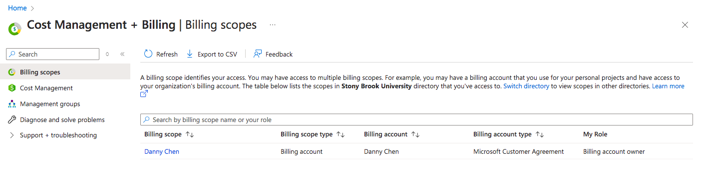
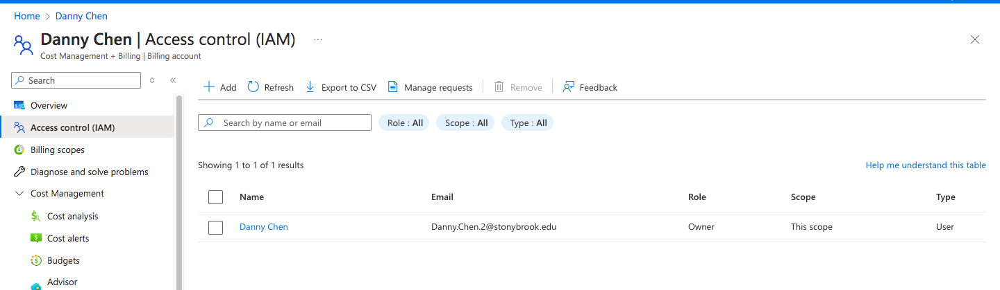
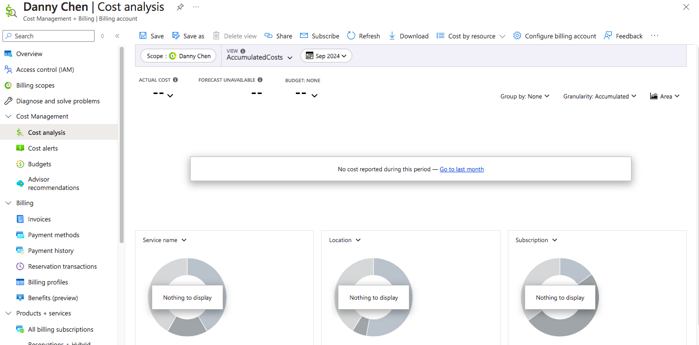
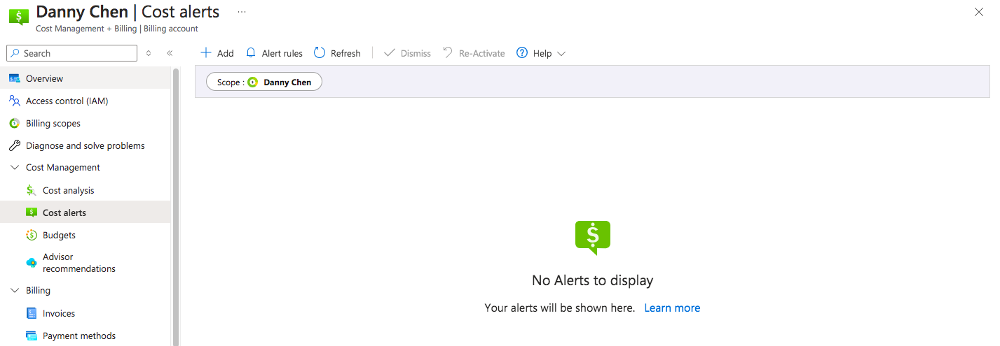
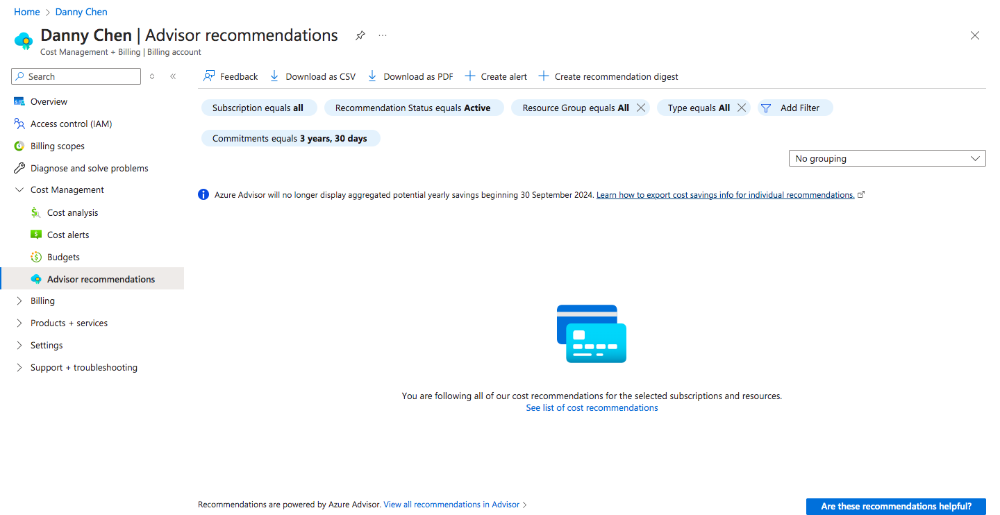

 

### GCP
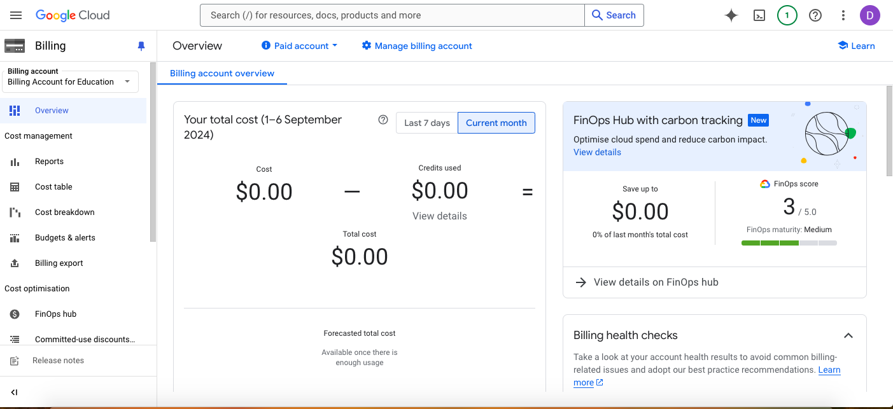
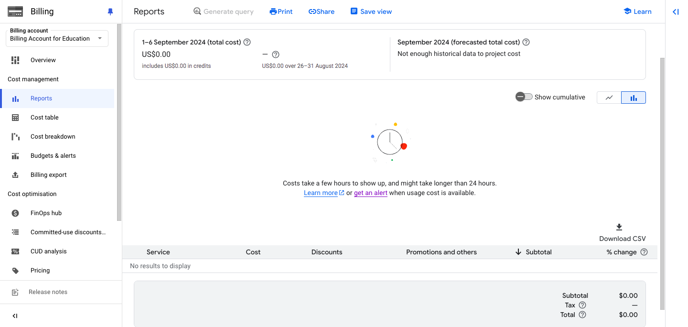
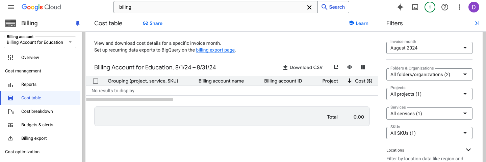
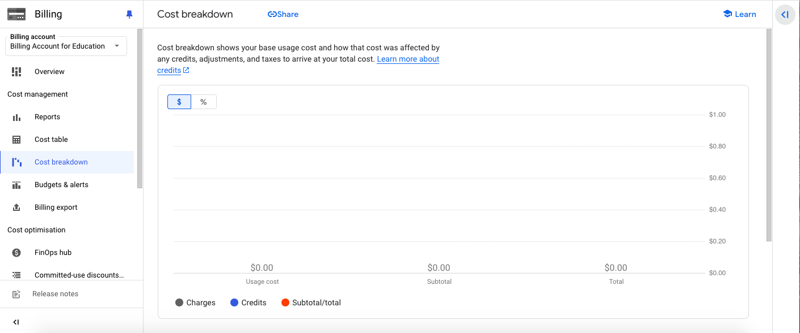
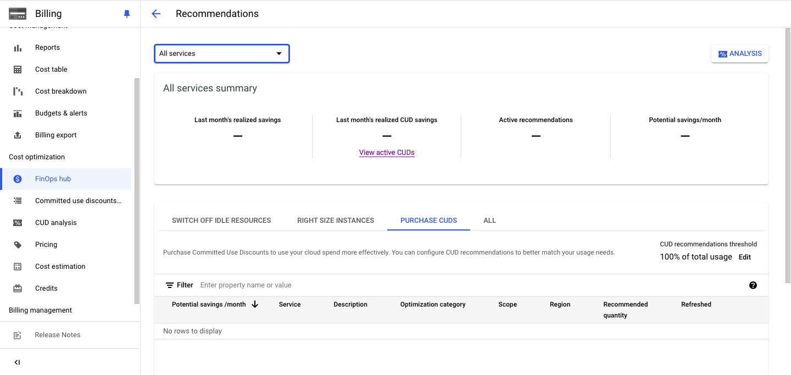
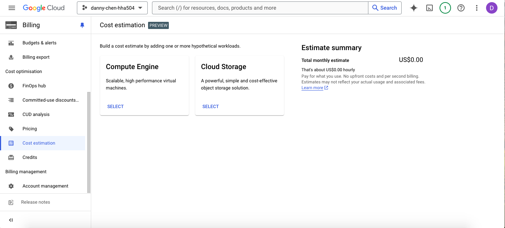
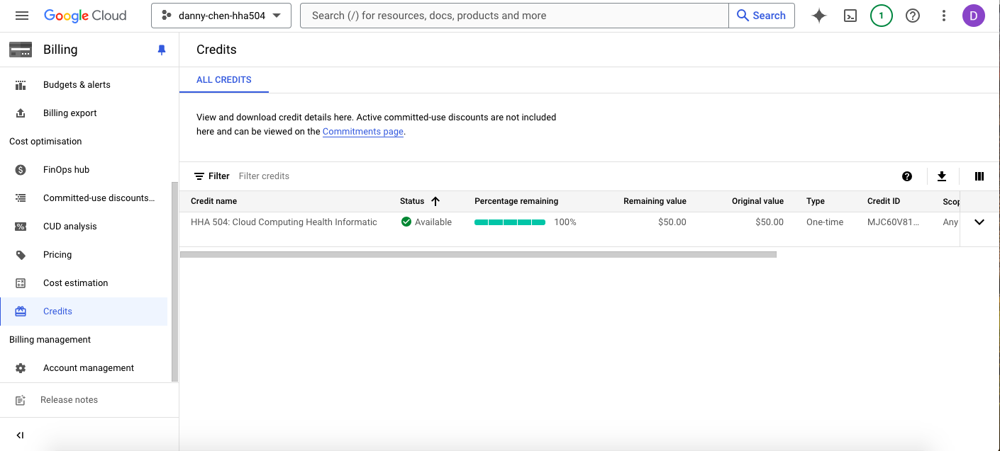
 

### Azure Budget Setup
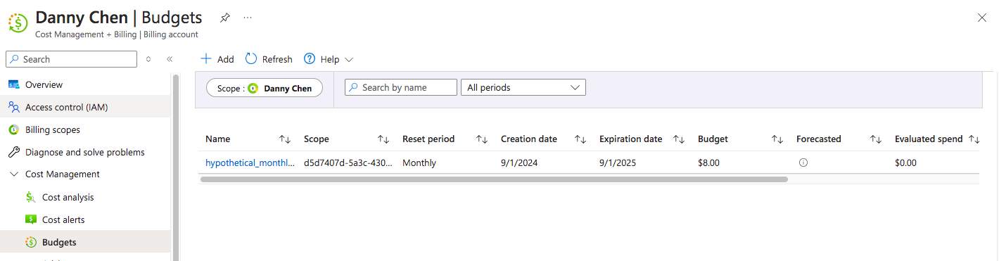
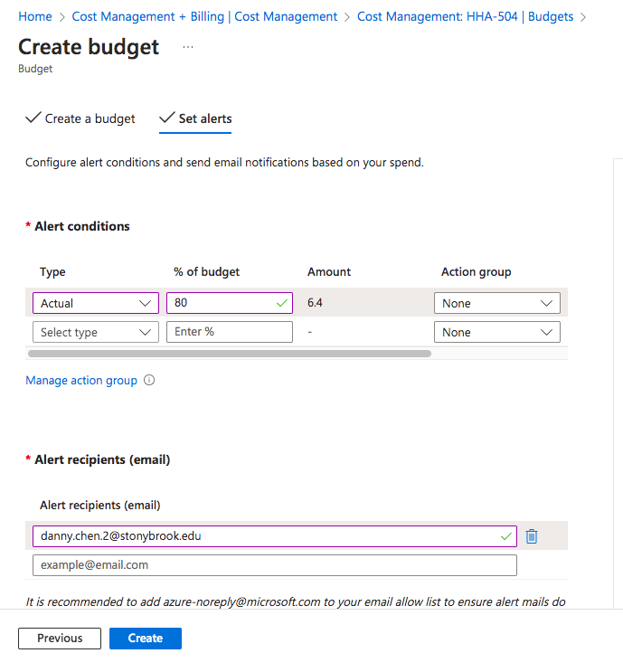
 

### GCP Budget Setup
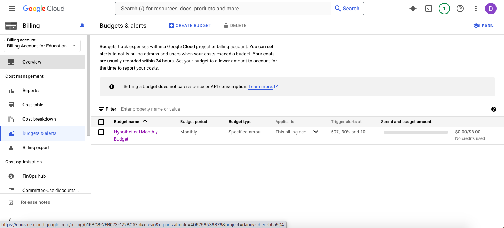
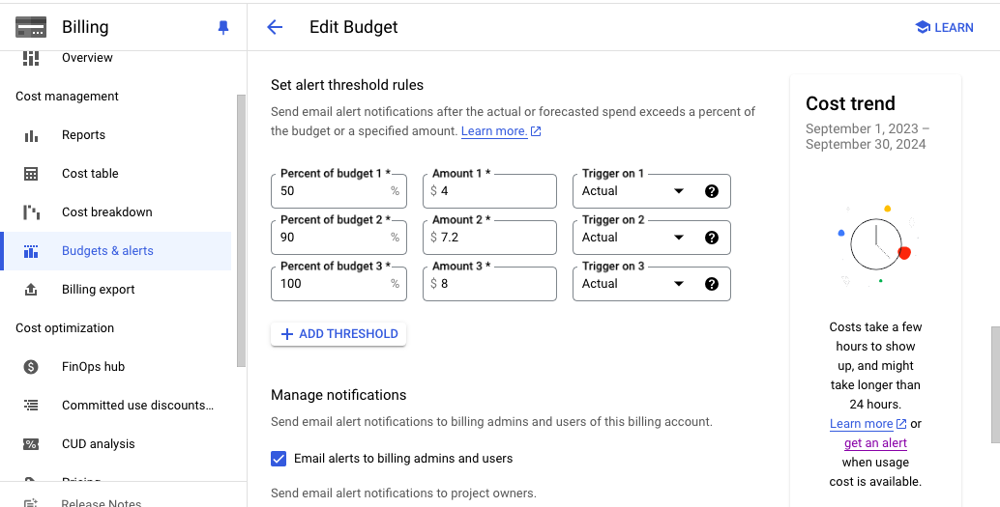

## Interesting/Useful Features
Being able to set budgets, get alerts, and recommendations are cost management features I found useful in both GCP and Azure. For businesses that need to be strict with resource allocation, this helps avoid overspending, reduces financial oversight, and keeps things more under control.

The features of GCP itself that I found useful are its Reports, Cost table, and Cost breakdown sections. Reports lets you view the total cost of either all projects or all services from a desired range of months. Cost table appears to let you view the individual cost of projects, services, and SKU for a specific invoice month. Cost breakdown provides a visual representation of usage cost and how that cost may have been affected by credits, adjustments, and taxes to arrive at the final total. Being able to view costs from these different angles can help provide a clearer understanding of where money is going and ensure it is being used efficiently. 

The features of Azure itself that I found useful are its Cost analysis and Cost alert sections. Similar to GCP's cost sections, Cost analysis allows you to view various costs within your selected time range. While alerts are sent to emails, they can be viewed in the Cost alert section too. Users could sometimes overlook alerts that appear in their email, so having more than one location to view them can alleviate that issue. 

The Saving plans section is a feature that I found interesting and potentially useful as Azure's website states that users can reduce usage cost by up to 65% if they commit to an hourly spend for 1 or 3 years. Organizations and individuals who will use Azure for the long-term would likely benefit most from this and save a lot on cost. 