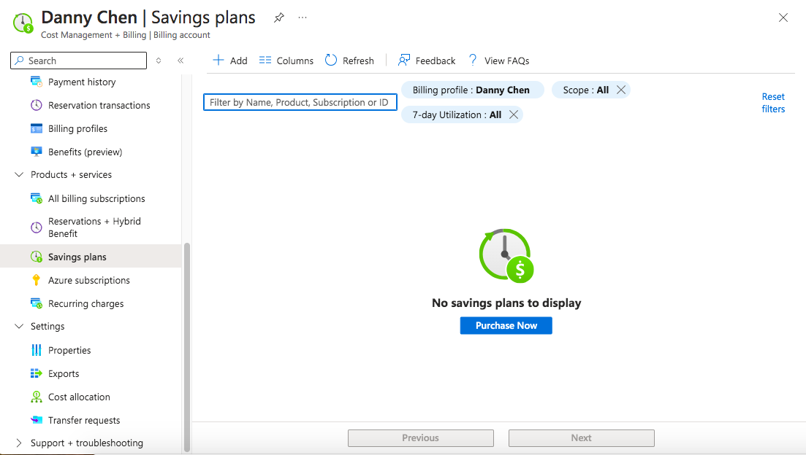

# Assignment: Exploring Cost Management and Billing on Azure and GCP

## Screenshots from Exploring Cost Management and Billing Dashboard
### Azure 

### GCP

### Azure Budget Setup

### Azure Budget Setup

## Interesting/Useful Feature
Being able to set budgets and get alerts alongside recommendations are cost management features I found useful in both GCP and Azure. For businesses that need to be strict with resource allocation, this helps avoid overspending, reduces financial oversight, and keep things more under control.  

The features of GCP itself that I found useful are its Reports, Cost Table, and Cost Breakdown section. Reports lets you view the total cost of either all projects or all services from a desired range of months. Cost Table appears to let you view the individual cost of projects, services, and SKU for a specific invoice month. Cost breakdown provides a visual representation of usage cost and how that cost may have been affected by credits, adjustments, and taxes to arrive at the final total. Being able to view costs from these different angles can help provide a clearer understanding of where money is going and ensure it is being used efficiently. 

The features of Azure itself that I found useful are its Cost analysis and Cost alert sections. Similar to GCP's cost sections, Cost analysis allows you to view various cost within your selected time range. While alerts are sent to email, users can also view alerts in the Cost alert section. Users could overlook alerts that appear in their email, so having more than one location to view alerts can alleviate that issue. 

THe Savings plans section is a feature that I found interesting as Azure's website states that users can reduce usage cost by up to 65% if they commit to an hourly spend for 1 or 3 years. Organizations and individuals who will use Azure for the long-term will likely benefit most from this feature and save a lot on cost. 